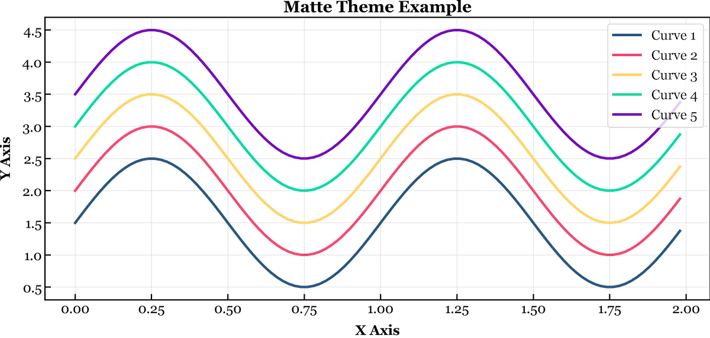

# Matte Theme for Matplotlib
 A custom theme for matplotlib! I'm currently working on a dark mode.


## Example:



## Installation:

Instructions to install and use this theme:

1. Clone this repository (or download the files)
   `git clone https://github.com/andrematte/matte-matplotlib`
2. From the cloned directory, run the installation script
   `python matte-install.py`
3. The script will copy the theme file to your matplotlib directory and it's ready to use!


## How to use it:

To can set Matte as the current theme:

```python
import matplotlib.pyplot as plt
plt.style.use('Matte')
```


## License:

[MIT License](https://github.com/andrematte/matte-matplotlib/blob/master/LICENSE)

